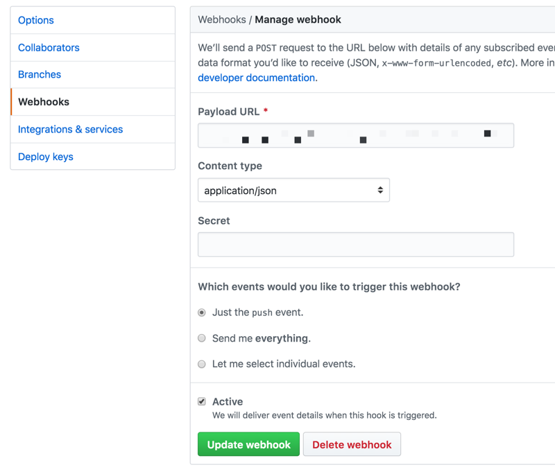

# Post Commit

## Summary

Provides an endpoint to your website to use as a webhook for git post commit hooks.  When triggered the endpoint will queue a `git pull` to be executed by cron.  This allows you to automate a deployment (plus whatever you want, e.g. Drupal cache clear), whenever you push to your repository.  By leveraging cron, you can keep tight permissions and run your git pull as the cron user, not, say, `apache`.  Intended to be used for staging websites, rather than production where you would want to deploy manually.

**Visit <https://aklump.github.io/post_commit> for full documentation.**

## Quick Start

### Part 1 of 4

1. Install in your repository root using `cloudy pm-install aklump/post_commit`
1. Open _bin/config/post_commit.yml_ and set configuration.  I encourage you to use wildcards for the repository and branch at first to get things working; you can tighten that up later.
1. Create the _logs_ directory as configured in the previous step; be sure to **ignore this file** in SCM.
1. Open _bin/config/post_commit.local.yml_ and modify as needed; be sure to **ignore this file** in SCM.
1. Modify as needed and add _bin/auto_deploy.sh_ to SCM.
1. Run `./bin/post_commit init` to finish installing.
1. Give write permissions to both owner and group for _logs/*_, e.g. `chmod -R ug+w logs`

> Pro Tip: Run `./bin/post_commit config-check` at any time to reveal configuration problems.

### Part 2 of 4: Test Endpoint

1. Determine the URL endpoint of the webhook, e.g., 

        https://{website}/scheduler.php?key={url_private}

1. Begin monitoring the _pending.txt_ log using `tail -f pending.txt`.
1. Open the endpoint in your browser, you should see something like:

        origin user:
        repo:
        branch: *
        PHP user: apache
        127.0.0.1
        Tue, 30 Oct 2018 11:25:09 -0700
        jobs added: 1
        --------------------------------------------------------------------------------
1. Assert that the absolute path to the job is appended to _pending.txt_.
1. Begin monitoring the _complete.txt_ log using `tail -f complete.txt`.
1. Manually run the jobs with `./bin/post_commit run`.
1. Assert you see output from your job in _complete.txt_.
1. If you wish to test your endpoint response to a certain repo or branch, use `?&repo={repo}&branch={master}`. 

### Part 3 of 4: Register Web Hook

1. Log in to your server and `cd` to the logs directory.
1. Begin monitoring the _orders.txt_ log using `tail -f orders.txt`.  When you save your webhook below, you should see content appended--a new order--which indicates things are working correctly.  It will resemble:

        $ tail -f orders.txt
        origin user: aklump
        repo: aklump/post_commit
        branch: *
        --------------------------------------------------------------------------------

1. If you the site is HTTP Authorized, you will need to add credentials to the URL:        

        https://{user}:{password}@{website}/scheduler.php?key={url_private}
        
1. Compile the post commit hook url and add it to your github project.
            
    * Keep the key in the url, do not use the secret textfield.
    * Choose the json format.
    * Make sure to use https if you can, a self-signed cert should work fine.
    * Save the webhook and check _orders.txt_ for a change.

### Part 4 of 4: Setup cron job

1. Set up a cron job to execute `./bin/post_commit run` and log the output.

        * * * * * ./bin/post_commit run >> /path/to/.../logs/cron.txt

1. Begin monitoring _cron.txt_ using `tail -f cron.txt`.  Wait for the next cron run and assert content was appended to _cron.txt_.

1. Now, test the whole setup by committing to your repo and asserting that _auto_pull.sh_ was indeed executed by cron.
1. Remove wildcards in the configuration `repository_name` and `branch_name` values as necessary.
1. Disable cron logging in your crontab with:

        * * * * * ./bin/post_commit run > /dev/null

1. Lastly, run `./bin/post_commit empty-logs` to flush all logs.
1. You're done.

---
            
## About the Log Files

Rather than deleting log files, truncate them with `./bin/post_commit empty-logs`.  This will maintain the correct permissions.

| basename | description |
|----------|----------|
| _orders.txt_ | A running list of incoming pings.  |
| _last.json_ | The payload from the last ping. |
| _pending.txt_ | Authorized jobs that are waiting to be run. |
| _complete.txt_ | All jobs that have been run.  These have been moved from pending. |
| _cron.txt_ | Output from the cron job that controls the runner. |

## Requirements

* You must have [Cloudy](https://github.com/aklump/cloudy) installed on your system to install this package.

* Your repository may not use a passphrase, as this prevents the automatic git pull.

## Installation

The installation script above will generate the following structure where `.` is your repository root.

    .
    ├── bin
    │   ├── post_commit -> ../opt/post_commit/post_commit.sh
    │   └── config
    │       ├── post_commit.yml
    │       └── post_commit.local.yml
    ├── opt
    │   ├── cloudy
    │   └── aklump
    │       └── post_commit
    └── {public web root}

    
### To Update

- Update to the latest version from your repo root: `cloudy pm-update aklump/post_commit`

## Configuration Files

| Filename | Description | VCS |
|----------|----------|---|
| _post_commit.yml_ | Configuration shared across all server environments: prod, staging, dev  | yes |
| _post_commit.local.yml_ | Configuration overrides for a single environment; not version controlled. | no |
| scheduler.php | This should be pinged by a post commit hook on the origin repo via https and including the secret key.  | yes  |

## Usage

* To see all commands use `./bin/post_commit help`

## Troubleshooting

### Jobs get scheduled but not run?

1. Check to make sure the the logs directory and all log files are owned by the cron user and the group is the php user and that both user and group has rw permissions.

1. Does the git repo require a passphrase for pulling?  You will have to disable that.

1. Try logging in to the server as the cron user and running the command.

1. Make sure you can git pull manually using your ssh keys, etc.

## Contributing

If you find this project useful... please consider [making a donation](https://www.paypal.com/cgi-bin/webscr?cmd=_s-xclick&hosted_button_id=4E5KZHDQCEUV8&item_name=Gratitude%20for%20aklump%2Fpost_commit).
